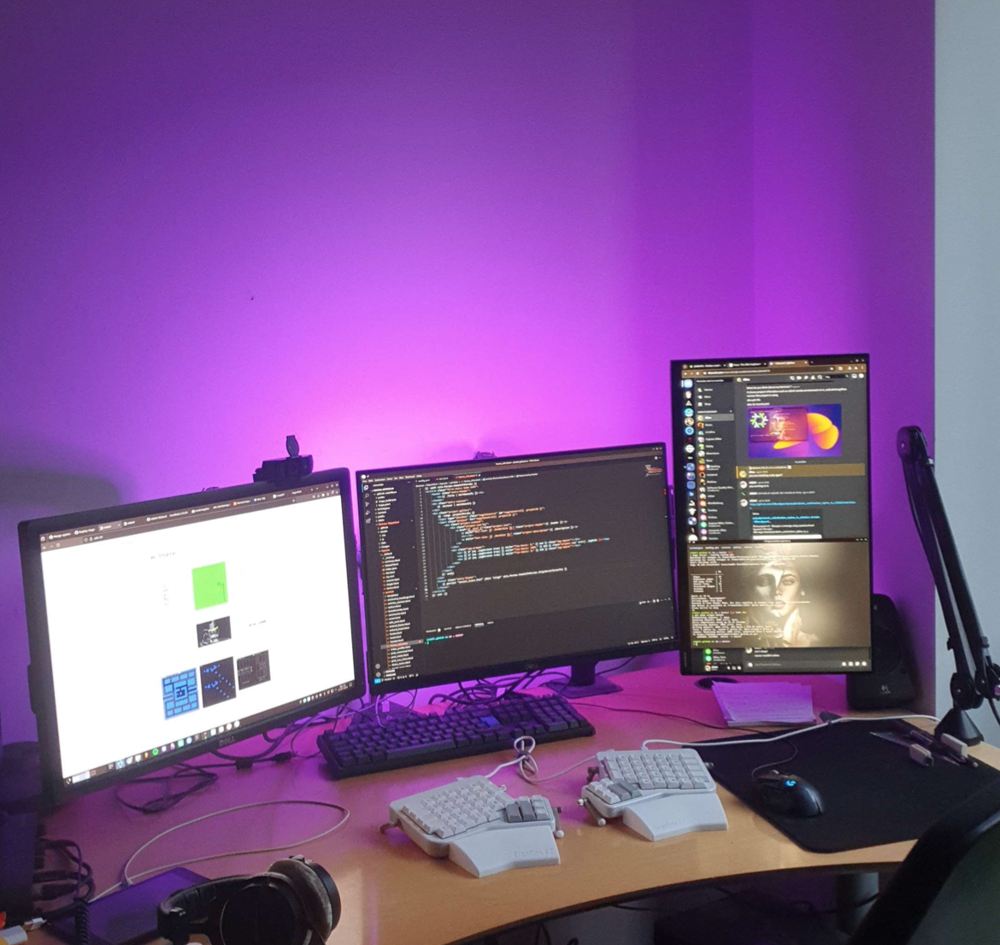

# What is this?
It's the Arduino code used to control some of my WS2812 LED's.

# Usage
- Download the Adafruit Neopixel library from the Arduino IDE, or fetch it from the Adafruit Neopixel [repository](https://github.com/adafruit/Adafruit_NeoPixel).
- Set LED_COUNT to number of LED's.
- Connect Arduino GND, 5V and pin 4, to the WS2812 GND, 5V, and DATA lines. (Change DATA signal pin as needed.) 
- Compile and upload to Arduino.

# Example

  

